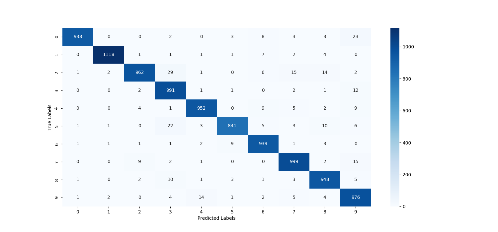



# Model Performance

The neural network model was trained on the MNIST dataset for handwritten digit recognition. Below are the performance metrics and observations from the training and evaluation phases.

## Training Performance

The model was trained for 10 epochs with the following results:

- **Epoch 1**: Accuracy: 84.44%, Loss: 0.5253
- **Epoch 2**: Accuracy: 95.76%, Loss: 0.1431
- **Epoch 3**: Accuracy: 96.93%, Loss: 0.0990
- **Epoch 4**: Accuracy: 97.68%, Loss: 0.0767
- **Epoch 5**: Accuracy: 98.12%, Loss: 0.0623
- **Epoch 6**: Accuracy: 98.48%, Loss: 0.0514
- **Epoch 7**: Accuracy: 98.67%, Loss: 0.0437
- **Epoch 8**: Accuracy: 98.90%, Loss: 0.0373
- **Epoch 9**: Accuracy: 99.06%, Loss: 0.0319
- **Epoch 10**: Accuracy: 99.09%, Loss: 0.0282

## Evaluation Performance

- **Test Accuracy**: 96.29%
- **Test Loss**: 0.1615

## Confusion Matrix

The confusion matrix for the test dataset is visualized using a heatmap to show the distribution of true vs. predicted labels.



## Observations

- The model achieves high accuracy on both the training and test datasets, indicating good generalization.
- The confusion matrix shows that the model performs well across all digit classes, with minimal misclassifications.

## Conclusion

The neural network model effectively recognizes handwritten digits with high accuracy, achieving a test accuracy of 96.29%. The model demonstrates strong generalization capabilities across the MNIST dataset, with minimal misclassifications as shown in the confusion matrix. 